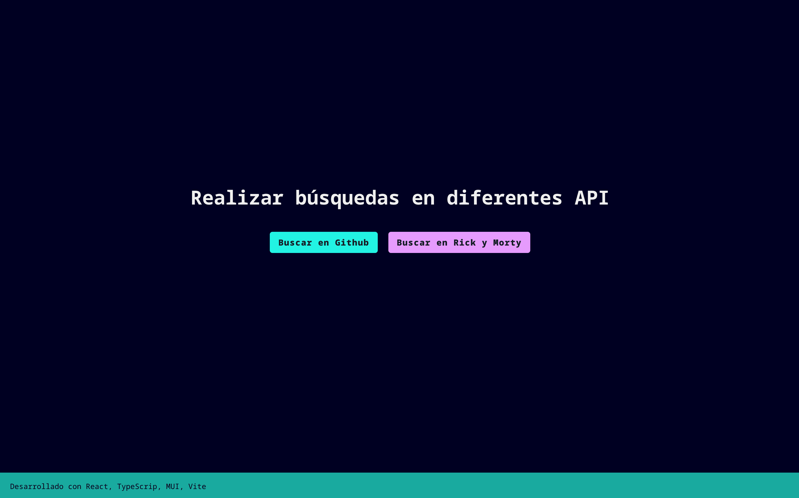

# Buscador (En desarrollo)

## Ejemplo en vivo

- [Ver página](https://buscador-ofmd.onrender.com/)

## Descripción 📑

El proyecto consiste en un buscador que utiliza dos APIs, la de GitHub y la de Rick y Morty, para mostrar información relevante. Está construido utilizando tecnologías como React, TypeScript, Material-UI (MUI), y Vite. La aplicación consta de tres páginas principales: la página de inicio, la página de búsqueda de compañías en GitHub y la página de búsqueda de personajes de Rick y Morty.

## ¿Qué he aprendido en este proyecto? 🙇🏻

Este proyecto ha sido una valiosa oportunidad para adquirir y consolidar habilidades en el desarrollo web, específicamente enfocadas en React, TypeScript, Material-UI (MUI), y Vite. Algunos de los aprendizajes clave incluyen:

1. React y TypeScript: He mejorado mi conocimiento y habilidades en React, especialmente en la implementación de componentes funcionales y de clase, el uso de hooks, y la integración con TypeScript para garantizar un código más robusto y seguro.

2. Integración con Múltiples APIs: He aprendido a integrar múltiples APIs en una aplicación React, en este caso, la API de GitHub y la API de Rick y Morty. Esto incluye realizar solicitudes HTTP, manejar respuestas y mostrar la información de manera efectiva en la interfaz de usuario.

3. Material-UI (MUI): He utilizado Material-UI para estilizar la aplicación y crear una interfaz de usuario atractiva y fácil de usar. Esto ha implicado trabajar con componentes preestablecidos de MUI y personalizarlos según las necesidades del proyecto.

4. Gestión de Estado con Context API: He aplicado la Context API de React para gestionar y compartir información relevante, como la compañía seleccionada, la página actual y los personajes de Rick y Morty. Esto contribuye a una experiencia de usuario más cohesiva y sin problemas.

5. Optimización y Eficiencia: He aprendido a optimizar la aplicación para garantizar un rendimiento óptimo, incluyendo técnicas de paginación para cargar y mostrar grandes cantidades de datos de manera eficiente.

En resumen, este proyecto ha ampliado mi comprensión de las tecnologías mencionadas y me ha permitido aplicarlas en un contexto real, resultando en una aplicación funcional y atractiva que ofrece una experiencia de usuario mejorada al interactuar con dos APIs diferentes. Estoy emocionada por seguir explorando y aplicando estas habilidades en futuros proyectos.

## Tecnologías 🛠

<!-- Iconos sacados de: https://github.com/hendrasob/badges/blob/master/README.md y https://github.com/alexandresanlim/Badges4-README.md-Profile -->

>)

## Autora ✒️

**Leticia de la Osa**

- [contacto@deletidev.com](mailto:contacto@deletidev.com)
- [LinkedIn](https://www.linkedin.com/in/deletidev)
- [Mi porfolio web](https://deletidev.com/)

## Instalación ⚙️

- Clonate el proyecto.
- Instala las dependencias con `npm install`.
- Ejecuta el sandbox con `npm run dev` o primero `npm run build` seguido de `npm run preview`.
- Abre el navegador en `http://localhost:4173/` (si ese puerto no te funciona, mira en la consola donde has hecho el build, puede que este ocupado y se haya abierto en otro puerto).

## Licencia 📄

MIT Public License v3.0
No puede usarse comercialmente.
